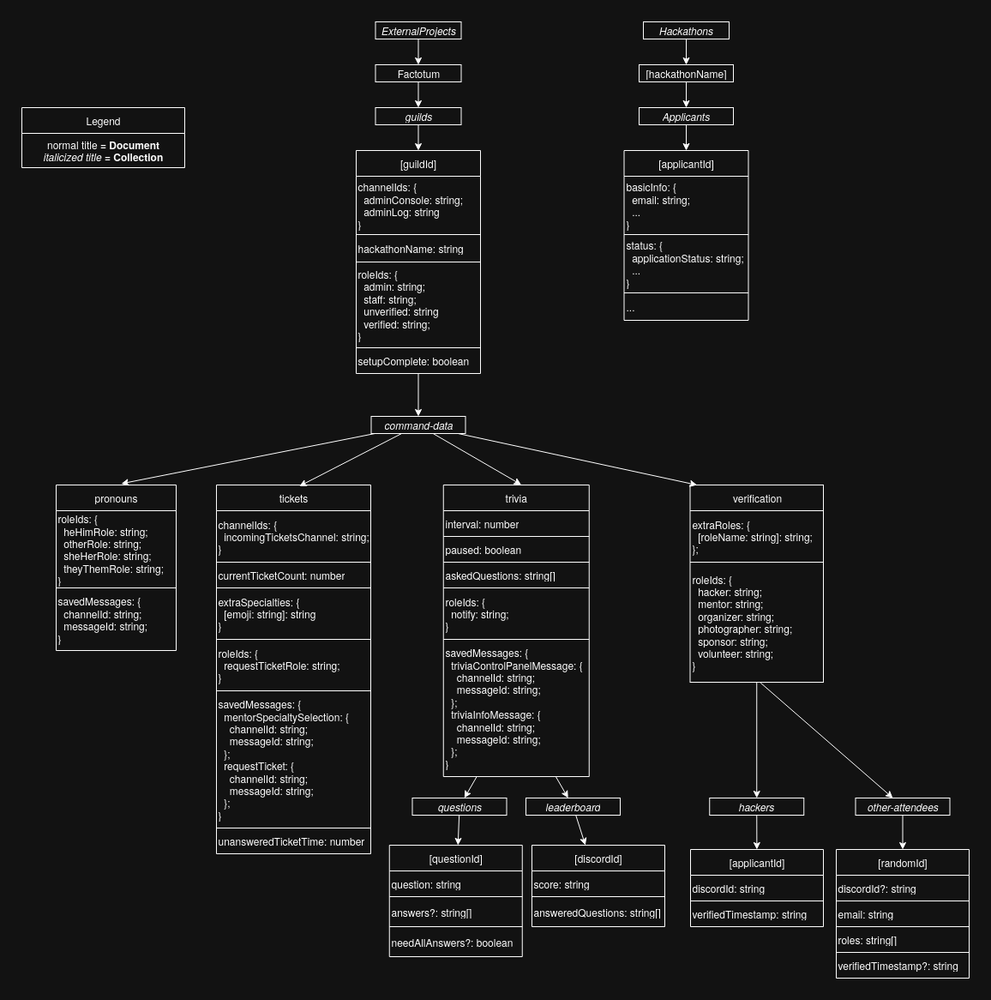

## Development

This project uses [Sapphire](https://www.sapphirejs.dev/) for the command framework.
Sapphire allows us to define Discord commands and event handlers declaratively, making it a lot easier to understand what's going on.

Sapphire separates the lifecycle of bot interactions into a few main categories: commands, interaction handlers, and listeners.

## Commands

Commands are the entry point for organizers to direct the bot.
All commands should go in `src/commands/` and should be named like `MyCommand.ts`.
Use the Sapphire CLI to add new commands with the provided template:

```bash
$ npx sapphire generate slashcommand MyCommand
```

This will create a new file `src/commands/MyCommand.ts` with a barebones template for a new command.
By default, this template will create a command that is only available in server text channels
and is only runnable by users with the admin or staff role.
We use the `AdminRoleOnly` precondition to enforce this.

### Preconditions

Preconditions are defined in `src/preconditions/` and should be named like `MyPrecondition.ts`.

Preconditions are used to enforce certain conditions on a command.
As the name implies, they are run before a command is executed, so if the condition fails the command will not be executed.
For example, we use the `AdminRoleOnly` precondition to enforce that a command can only be run by users with the admin or staff role.

## Interaction Handlers

Interactions are the main way that users interact with the bot by interacting with the messages it sends.
Interaction handlers are defined in `src/interaction-handlers/` and should be named like `MyInteractionHandler.ts`.

Use an interaction handler if you have any long-lived interactive elements, such as buttons, select menus, etc.
Follow https://sapphirejs.dev/docs/Guide/interaction-handlers/what-are-they for more information.

As an example, the `/start-report` command sends a message with a button that can be clicked to let a user create a report.
We have an interaction handler, `ReportHandler.ts`, that triggers when the button with the matching custom ID is clicked.

## Listeners

Listeners are defined in `src/listeners/` and should be named like `MyListener.ts`.

Listeners are used to handle any events that could be emitted by Discord.
Follow https://sapphirejs.dev/docs/Guide/listeners/what-are-listeners-and-how-do-they-work for more information.

The main thing we use listeners for is to listen for emoji reactions from users.
When we send a message that we want to track, we save the message and channel ID to Firebase.
In our listener, we listen for the reaction add/remove event and check if the message matches the one we saved.

**Note**: These events are only triggered for messages that our bot has fetched into its cache.
When you send a message, the bot will automatically add that message to the cache, but if the bot is restarted, that message will be lost.
That is why in `index.ts`, we need to fetch all messages that we want to track reactions for.

As an example, the `/start-pronouns` command sends a message where users can react with an emoji to get the proper pronoun role.
We have a `PronounsReactionAdd.ts` and `PronounsReactionRemove.ts` listener that are triggered on emoji add and remove events,
and add/remove the corresponding role from the user if the message matches the one we saved.

## General Notes

### Reply to interactions

Make sure that you always reply to interactions, or else Discord will show that the bot failed to respond.
If you are doing something potentially time-consuming like working with the database, you can defer the interaction to later
using:

```ts
await interaction.deferReply();
```

You can then later use:

```ts
await interaction.followUp({ content: "..." });
```

to send a reply to the user.

### Ephemeral messages

A lot of our commands send ephemeral messages, meaning that they only show up to the user who ran them.
To make a command ephemeral, you can use the `MessageFlags.Ephemeral` flag.

For example:

```ts
import { MessageFlags } from "discord.js";

await interaction.reply({ content: "...", flags: [MessageFlags.Ephemeral] });
```

### Working with Firebase

Make use of the utils and types that we have for working with Firebase.
The general pattern we use is to get a reference to the document we want to work with,
and then use the `get()` method to fetch the data and `.data()` to get the full object which we can then typecast to the correct type.

These types correspond to the structure of data stored in collections in Firebase. Use the schema below as reference.

For example:

```ts
const guildDocRef = getGuildDocRef(guild.id);
const guildDocData = (await guildDocRef.get()).data() as GuildDoc;
```

---

## Schema


